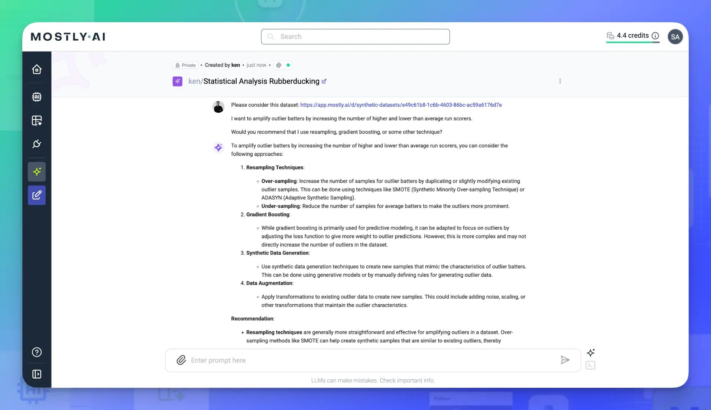

# Rubberduck experiment techniques

You can even use the Assistant to help you develop and design your data science experiments. Not sure whether it makes more sense to use Gradient Boosting or just standard Resampling? Ask the Assistant to inspect the data and offer feedback about your proposed strategy. You can understand whether a proposed experiment is worth pursuing, or unlikely to deliver meaningful results.

Ask specific questions based on statistical trends and features of any dataset.

**Example Prompts:**

- `What statistical methods can I use to detect outliers in player performance?`
- `How can I identify players whose stats deviate significantly from league averages?`
- `Which players had breakout seasons based on sudden spikes in OPS or ERA?`

